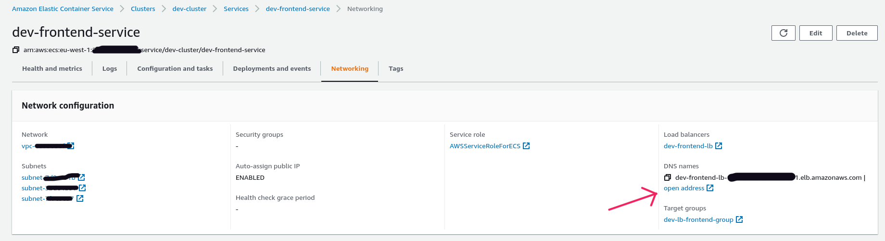

# Devops Test
This repo is for devops test for OvalHR

## What's included
* A dummy frontend with just a simple hello world html page using docker and nginx
* A dummy backend with no APIs and DB integrations using docker
* A mysql DB in RDS because the requirement is to use relational database and I don't know how to scale relational DB horizontally. So I did not use dockerized DB
* DB username and password passed using terraform variables but can be improved using aws secretsmanager

## Packages to install
* Terraform (https://learn.hashicorp.com/tutorials/terraform/install-cli)
* awscliv2 (https://docs.aws.amazon.com/cli/latest/userguide/getting-started-install.html)
* docker (https://docs.docker.com/engine/install/#server)

## Steps to deploy
* Clone the repo
* Install above packages for your desired OS
* Create an aws IAM user with following permissions
* Set the IAM user's access key and secret access to ~/.aws/credentials as    
```text
[your-iam-profile]
aws_access_key_id = your-iam-access-key
aws_secret_access_key = your-iam-secret-access
```
* Add `your-iam-profile` to `aws_profile = "your-profile"` part of terraform/development/module.tf so it will be `aws_profile = "your-iam-profile"`
* Now go to development dir by `cd terraform/development/`
* Change other terraform variables if you want in `module.tf` file
* Run following commands sequentially
```shell
terraform init
terraform plan
terraform apply -auto-approve
```

## Check if services are running
* To check if frontend service is running with sample page go to `Amazon Elastic Container Service -> Clusters -> <prefix>-cluster -> Services -> <prefix>-frontend-service -> Networking` and click on `open address` at "DNS names"

* Same checking can be done with backend service. Note that backend service will show you if db connection is okay.